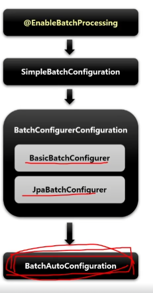
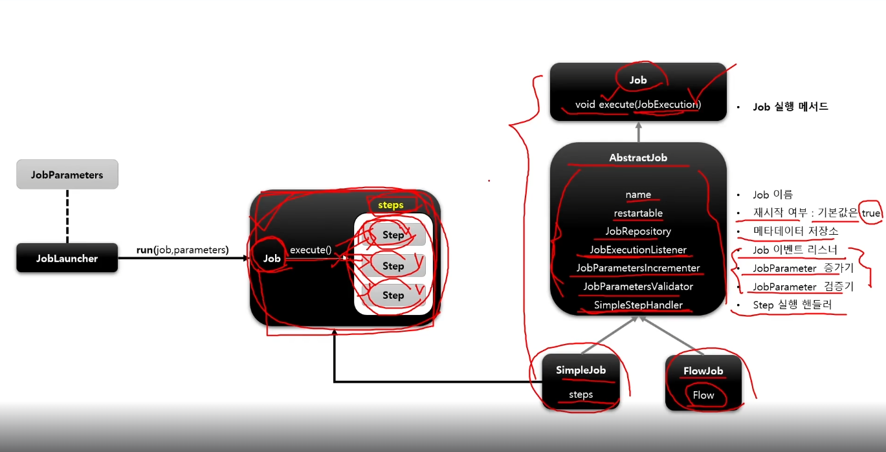
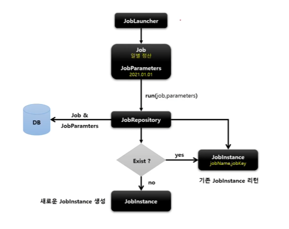

# spring-batch-lecture
[inflearn 스프링 배치](https://www.inflearn.com/course/%EC%8A%A4%ED%94%84%EB%A7%81-%EB%B0%B0%EC%B9%98/dashboard)

---

# 배치 핵심 패턴(ETL)
- Read: 데이터베이스, 파일, 큐에서 다량의 데이터를 조회한다.
- Process - 특정 방법으로 데이터를 가공한다.
- Write - 데이터를 수정된 양식으로 다시 저장한다.

---

# 배치 시나리오
- 배치 프로세스를 주기적으로 커밋
- 동시 다발적인 Job의 배치처리, 대용량 병렬처리, 서로 간섭이 없어야함
- 실패 후 수동 또는 스케줄링에 의한 재시작
- 의존관계가 있는 step 여래 개를 순차적으로 처리
- 조건적 Flow 구성을 통한 체계적이고 유연한 배치 모델 구성
- 반복, 재시도, skip 처리

---

# 사용 이유
- 개발자는 업무로직의 구현에만 집중하고 공통적인 기반기술은 프레임워크가 담당

---

# @EnableBatchProcessing
- 스프링 배치 활성화
- 총 4개의 설정 클래스를 실행
- 스프링 배치의 모든 초기화 및 실행 구성
- 스프링 부트 배치의 자동 설정 클래스가 실행
- 빈으로 등록된 모든 job을 검색해서 초기화와 동시에 job을 수행
- 설정클래스
  - BatchAutoConfiguration
    - 스프링배치가 초기화 될때 자동으로 실행되는 설정 클래스
    - job을 수행하는 JobLauncherApplicationRunner 빈을 생성
  - SimpleBatchConfiguration
    - JobBuilderFactory와 StepBuilderFactory 생성
    - 스프링 배치의 주요 구성 요소 생성-프록시객체로 생성됨
  - BatchConfigurerConfiguration
    - BasicBatchConfigurer
      - SimpleBatchConfiguration에서 생성된 프록시 객체의 실제 대상 객체를 생성하는 설정클래스
      - 빈으로 의존성 주입 받아서 주요 객체들을 참조해서 사용
    - JpaBatchConfigurer
      - JPA 관련 객체를 생성하는 설정 클래스
    - 사용자 정의 BatchConfigurer 인터페이스를 구현하여 사용할 수 있음

---

# 핵심 용어
- Job: 일, 일감
  - Step: 일의 항목, 단계
    - Tasklet: 작업내용, 비즈니스로직

--- 

# SpringBatch의 DB 스키마
- https://docs.spring.io/spring-batch/docs/3.0.x/reference/html/metaDataSchema.html
- 실행정보 및 상태정보를 저장하는 메타테이블이 반드시 필요(자동이던 수동이던)
- 운영에서는 NEVER로 해두고 수동 생성하는 방식을 사용함
- SELECT * FROM BATCH_JOB_INSTANCE; -- 선언된 잡들, 하나만 생성됨
- SELECT * FROM BATCH_JOB_EXECUTION; -- 실제 실행된 잡들 저장, 여러개 생성됨, BATCH_JOB_INSTANCE와 외래키 관계
- SELECT * FROM BATCH_JOB_EXECUTION_PARAMS; -- 추후 설명
- SELECT * FROM BATCH_JOB_EXECUTION_CONTEXT; -- job간 공유 정보저장
- SELECT * FROM BATCH_STEP_EXECUTION; -- 실제 실행된 스텝들 저장, BATCH_JOB_EXECUTION과 외래키 관계

--- 

#Job
- 하나의 배치 작업 자체를 의미, Step들을 포함 하고있는 하나의 컨테이너
- 반드시 하나 이상의 Step으로 구성해야함
- SimpleJob: 순차적으로 Step 실행
- FlowJob: 조건에 따는 Step 실행(건너뛰기 가능)
- 

---

#JobInstance:
- job의 논리적 실행단위로 고유하게 식별 가능 한 작업 실행을 나타냄
- 실행할때마다 달라짐
- 동일한 job instance를 중복 실행할 수 없음
- 이전과 동일한 job과 job parameter로 실행할 경우 이미존재하는 jon instance를 리턴, 그래서 오류가남
- 

---

#JobParameter
- job을 실행할 때 함께 포함되어 사용되는 파라미터를 가진 도메인 객체
- 하나의 job에 존재할 수 있는 여러개의 job instance를 구분하기 위한용도
- STRING, DATE, LONG, DOUBLE 타입 지원
- JobParameters와 JobInstance는 1:1 관계
- job excution 테이블과 1:M 관계
- 이전과 동일한 job과 job parameter로 실행할 경우 이미존재하는 jon instance를 리턴, 그래서 오류가남
- 어플리케이션 실행 시 주입
  - java -jar spring-batch-lecture-0.0.1-SNAPSHOT.jar name=user1 seq(long)=2L date(date)=2021/01/01 age(double)=16.5
- 코드로 생성
  - JobParameterBuilder, DefaultJobParametersConverter
- SpEL 이용(SpEL(Sping Expression Language)은 스프링 프레임워크에서 사용할 수 있는 표현식 언어로, 런타임 시에 다양한 객체의 값을 동적으로 가져오거나, 설정을 통해 처리 로직을 정의할 때 사용)
  - @Value("#{jobParameter[requestDate]}"), @JobScope, @StepScope 선언 필수

[yml에서 자동설정 해제 하는법]
batch:
job:
enabled: false

[jar 실행 시]
java -jar spring-batch-lecture-0.0.1-SNAPSHOT.jar name=user1 seq(long)=2L date(date)=2021/01/01 age(double)=16.5

[intellij 실행 시 ]
Program Argument에 name=user1 seq(long)=2L date(date)=2021/01/01 age(double)=16.5 넣고  아래 소스 주석,  yml에 자동 배치 실행 한 다음 실행

---

#JobExecution
- JobInstance에 대한 한번의 시도를 의미하는 객체
- JobInstance와 JobExecution은 1:M의 관계로 JobInstance에 대한 성공/실패의 내역을 가짐
- Job실행 중에 발생한 정보들을 저장하고 있는 객체
  - 시작, 종료, 상태(시작됨, 완료, 실패), 종료상태의 속성을 가짐
- JobInstance 와의 관계
  - COMPLETED: JobInstance 실행이 완료된 것으로 간주히여 재실행 불가능
  - FAILED: JobInstance 실행이 완료되지 않은 것으로 간주하여 재실행 가능
    - JobParameter가 동일하더라도 재실행 가능
    - 파라미터가 동일할 경우 동일한 인스턴스를 가지고 재실행함

---