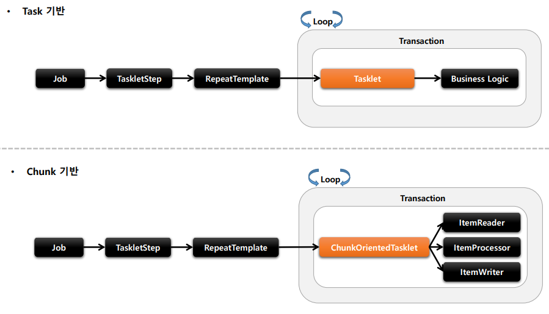

# spring-batch-lecture
[inflearn 스프링 배치](https://www.inflearn.com/course/%EC%8A%A4%ED%94%84%EB%A7%81-%EB%B0%B0%EC%B9%98/dashboard)

---

# 배치 핵심 패턴(ETL)
- Read: 데이터베이스, 파일, 큐에서 다량의 데이터를 조회한다.
- Process - 특정 방법으로 데이터를 가공한다.
- Write - 데이터를 수정된 양식으로 다시 저장한다.

---

# 배치 시나리오
- 배치 프로세스를 주기적으로 커밋
- 동시 다발적인 Job의 배치처리, 대용량 병렬처리, 서로 간섭이 없어야함
- 실패 후 수동 또는 스케줄링에 의한 재시작
- 의존관계가 있는 step 여래 개를 순차적으로 처리
- 조건적 Flow 구성을 통한 체계적이고 유연한 배치 모델 구성
- 반복, 재시도, skip 처리

---

# 사용 이유
- 개발자는 업무로직의 구현에만 집중하고 공통적인 기반기술은 프레임워크가 담당

---

# @EnableBatchProcessing
- 스프링 배치 활성화
- 총 4개의 설정 클래스를 실행
- 스프링 배치의 모든 초기화 및 실행 구성
- 스프링 부트 배치의 자동 설정 클래스가 실행
- 빈으로 등록된 모든 job을 검색해서 초기화와 동시에 job을 수행
- 설정클래스
  - BatchAutoConfiguration
    - 스프링배치가 초기화 될때 자동으로 실행되는 설정 클래스
    - job을 수행하는 JobLauncherApplicationRunner 빈을 생성
  - SimpleBatchConfiguration
    - JobBuilderFactory와 StepBuilderFactory 생성
    - 스프링 배치의 주요 구성 요소 생성-프록시객체로 생성됨
  - BatchConfigurerConfiguration
    - BasicBatchConfigurer
      - SimpleBatchConfiguration에서 생성된 프록시 객체의 실제 대상 객체를 생성하는 설정클래스
      - 빈으로 의존성 주입 받아서 주요 객체들을 참조해서 사용
    - JpaBatchConfigurer
      - JPA 관련 객체를 생성하는 설정 클래스
    - 사용자 정의 BatchConfigurer 인터페이스를 구현하여 사용할 수 있음


---

# 핵심 용어
- Job: 일, 일감
  - Step: 일의 항목, 단계
    - Tasklet: 작업내용, 비즈니스로직
- chunk: 데이터를 일괄 처리할 때 일정한 크기만큼 묶어서(chunk size) 처리하는 방식 chunk 기반 처리에서는 데이터를 청크 단위로 나누어 읽고, 처리하며, 그 결과를 청크 단위로 커밋
--- 

# SpringBatch의 DB 스키마
- https://docs.spring.io/spring-batch/docs/3.0.x/reference/html/metaDataSchema.html
- 실행정보 및 상태정보를 저장하는 메타테이블이 반드시 필요(자동이던 수동이던)
- 운영에서는 NEVER로 해두고 수동 생성하는 방식을 사용함
- SELECT * FROM BATCH_JOB_INSTANCE; -- 선언된 잡들, 하나만 생성됨
- SELECT * FROM BATCH_JOB_EXECUTION; -- 실제 실행된 잡들 저장, 여러개 생성됨, BATCH_JOB_INSTANCE와 외래키 관계
- SELECT * FROM BATCH_JOB_EXECUTION_PARAMS; -- 추후 설명
- SELECT * FROM BATCH_JOB_EXECUTION_CONTEXT; -- job간 공유 정보저장
- SELECT * FROM BATCH_STEP_EXECUTION; -- 실제 실행된 스텝들 저장, BATCH_JOB_EXECUTION과 외래키 관계

--- 


#Job
- 하나의 배치 작업 자체를 의미, Step들을 포함 하고있는 하나의 컨테이너
- 반드시 하나 이상의 Step으로 구성해야함
- SimpleJob: 순차적으로 Step 실행
- FlowJob: 조건에 따는 Step 실행(건너뛰기 가능)
- 

---

#JobInstance:
- job의 논리적 실행단위로 고유하게 식별 가능 한 작업 실행을 나타냄
- 실행할때마다 달라짐
- 동일한 job instance를 중복 실행할 수 없음
- 이전과 동일한 job과 job parameter로 실행할 경우 이미존재하는 jon instance를 리턴, 그래서 오류가남
- 

---

#JobParameter
- job을 실행할 때 함께 포함되어 사용되는 파라미터를 가진 도메인 객체
- 하나의 job에 존재할 수 있는 여러개의 job instance를 구분하기 위한용도
- STRING, DATE, LONG, DOUBLE 타입 지원
- JobParameters와 JobInstance는 1:1 관계
- job excution 테이블과 1:M 관계
- 이전과 동일한 job과 job parameter로 실행할 경우 이미존재하는 jon instance를 리턴, 그래서 오류가남
- 어플리케이션 실행 시 주입
  - java -jar spring-batch-lecture-0.0.1-SNAPSHOT.jar name=user1 seq(long)=2L date(date)=2021/01/01 age(double)=16.5
- 코드로 생성
  - JobParameterBuilder, DefaultJobParametersConverter
- SpEL 이용(SpEL(Sping Expression Language)은 스프링 프레임워크에서 사용할 수 있는 표현식 언어로, 런타임 시에 다양한 객체의 값을 동적으로 가져오거나, 설정을 통해 처리 로직을 정의할 때 사용)
  - @Value("#{jobParameter[requestDate]}"), @JobScope, @StepScope 선언 필수

[yml에서 자동설정 해제 하는법]
batch:
job:
enabled: false

[jar 실행 시]
java -jar spring-batch-lecture-0.0.1-SNAPSHOT.jar name=user1 seq(long)=2L date(date)=2021/01/01 age(double)=16.5

[intellij 실행 시 ]
Program Argument에 name=user1 seq(long)=2L date(date)=2021/01/01 age(double)=16.5 넣고  아래 소스 주석,  yml에 자동 배치 실행 한 다음 실행

---

#JobExecution
- JobInstance에 대한 한번의 시도를 의미하는 객체
- JobInstance와 JobExecution은 1:M의 관계로 JobInstance에 대한 성공/실패의 내역을 가짐
- Job실행 중에 발생한 정보들을 저장하고 있는 객체
  - 시작, 종료, 상태(시작됨, 완료, 실패), 종료상태의 속성을 가짐
- JobInstance 와의 관계
  - COMPLETED: JobInstance 실행이 완료된 것으로 간주히여 재실행 불가능
  - FAILED: JobInstance 실행이 완료되지 않은 것으로 간주하여 재실행 가능
    - JobParameter가 동일하더라도 재실행 가능
    - 파라미터가 동일할 경우 동일한 인스턴스를 가지고 재실행함

---

#Step
- Batch job을 구성하는 독립적인 하나의 단계로서 실제 배치처리를 정의하고 컨트롤하는데 모든 정보를 가지고 있는 도메인 객체
- 비즈니스로직담당
- 모든 job은 하나 이상의 step을 구성됨
- JobStep: step 내에서 job을 실행
- TaskletStep: 기본
- FlowStep: flow실행
- PartitionStep: 멀티스레드방식으로 step을 여러개로 분리 실행

---

#StepExecution
- Step에 대한 한번의 시도를 의미하는 객체로 Step 실행 중에 발생한 정보들을 저장하고 있는 객체
- Step이 실행될때마다 생성
- job이 재시작하더라도 이미 성공적으로 완료된 step은 재실행안되고 실패한 step만 실행
- 이전단계 step이 실패하면 다음 step은 실행되지 않음. 즉 StepExecution이 생성되지 않음
- StepExecution이 모두 정상적으로 완료되어야 JobExecution이 정상 완료
- StepExecution이 하나라도 실패하면 JobExecution은 실패
- JobExecution과 StepExecution은 1:M 관계

---

#StepContribution
- 청크 프로세스의 변경사항을 버퍼링 한 후 StepExecution 상태를 업데이트 하는 도메인객체
- 청크 커밋 직전에 StepExecution의 apply 메서드를 호출하여 상태를 업데이트
- ExitStatus의 기본 종료코드 외 사용자 정의 종료코드를 생성해서 적용

---

#ExecutionContext
- 프레임워크에서 유지 및 관리하는 키/값으로 된 컬렉션으로 StepExecution 또는 JobExcution 객체의 상태를 저장하는 공유객체
- DB에 직렬화 한 값으로 저장됨 {key:value}
- Step 범위: 각 Step의 StepContribution에 저장되며 step간 공유 안됨
- Job 범위: 각 Job의 JobExecution에 저장디면 job간 서로 공유 안되며 job의 스텝간 공유됨
- job 재 시작시 이미 처리한 row 데이터는 건너 뛰고 이후로 수행하도록 할 때 상태정보를 활용한다.

---

#JobRepository
- DB 관련작업(트렌잭션)을 대신 맡아줌
- 기본값으로 가장 엄격한 ISOLATION 급으로 설정
- JobExecutionListener를 구현하여 Job이 시작하기 전과 후에 추가 작업 할 수 있음
- BasicBatchConfigurer을 상속받아 커스텀 설정이 가능함

---

#JobLauncher
- JobLauncherApplicationRunner가 자동적으로 JobLauncher를 실행시킨다.
- 동기적실행: 스케줄링 또는 긴 배치에 적함
- 비동기적실행: HTTP 요청에의한 배치처리에 적합

--- 

#배치초기화 설정
- JobLauncherApplicationRunner
  - Spring Batch 작업을 시작하는 Application 리스너로서 BatchAutoConfiguration에서 생성됨
  - 스프링부터에서 제공하는 Application Runner의 구현체로 어플리케이션이 정상적으로 구동될때 마다 실행됨
  - 기본적으로 빈으로 등록된 모든 job을 실행시킨다.
- BatchProperties
  - spring batch의 환경 설정 클래스

```
spring:
  batch:
    job:
      #names: batchJob1,batchJob2 # 설정된 이름의 job만을 실행(,구분하여 여러개 가능)
      names: ${job.name:NONE} # Program Arguments 에서 --job.name=batchJob1,batchJob2
      enabled: true # 시스템 시작 시 자동 실행여부
      #enabled: false
    jdbc:
      initialize-schema: always # 시스템 시작 시 스키마 초기화 여부
      #initialize-schema: never
      #table-prefix: SYSTEM_ # 테이블 접미사, 기본은 BATCH_
```

---

#JobBuilderFactory / JobBuilder
- JobBuilderFactory JobBuilder를 생성하는 팩토리 클래스로서 get(String name) 메서드 제공
- JobBuilder: 
  - SimpleJobBuilder: Job실행과 관련된 여러 설정 API를 제공한다.
  - FlowJobBuilder: 내부적으로 FlowBuilder를 반환함으로써 Flow 실행과 관련된 여러 설정 API를 제공한다.
    - Flow: 조건부 분기나 순차 실행 등을 정의하는 데 유용


---

# SimpleJob batch api들
- .get(“batchJob"): JobBuilder 를 생성하는 팩토리, Job 의 이름을 매개변수로 받음
- .start: 처음 실행 할 Step 설정, 최초 한번 설정, 이 메서드를 실행하면 SimpleJobBuilder 반환
- .next(Step): 다음에 실행 할 Step 설정, 횟수는 제한이 없으며 모든 next() 의 Step 이 종료가 되면 Job 이 종료된다
- .incrementer(JobParametersIncrementer): JobParameter 의 값을 자동을 증가해 주는 JobParametersIncrementer 설정
- .preventRestart(true):  Job 의 재 시작 가능 여부 설정, 기본값은 true
- .validator(JobParameterValidator): JobParameter 를 실행하기 전에 올바른 구성이 되었는지 검증하는 JobParametersValidator 설정
- .listener(JobExecutionListener): Job 라이프 사이클의 특정 시점에 콜백 제공받도록 JobExecutionListener 설정
- .build(): SimpleJob 생성

---

# validator()
- job 실행에 필요한 파라미터를 검증하는 용도
- DefaultJobParameterValidator: 필수 키의 값이 존재하는지만 확인

---

# preventRestart
- 해당 옵션을 false로 설정 시 job이 실패해도 재시작 안되게 설정
- false일 때 재시작하게되면 JobRestartException 발생
- job을 처음 실행할때는 아무런 영향 x
- 해당 오퍼레이터 선언 시 기본값은 false

---

# incrementer
- JobParameters에 필요한 값을 증가시켜 다음에 사용될 JobParameter 오브젝트를 리턴
- 기존의 JobParameter 변경 없이 Job을 여러번 시작하고자 할때
- RunIdIncrementer 구현체를 지원하며 인터페이스를 직접 구현할 수 있음

---

# TaskletStep
- 스프링 배치에서 제공하는 Step의 구현체로 Tasklet을 실행시키는 도메인 객체
- RepeatTemplate를 사용해 Tasklet의 구문을 트랜잭션 경계 내에서 반복실행
- Task기반과 Chunk 기반으로 나누어져 Tasklet을 실행함
  - Chunk 기반
    - 청크 단위로 트랜잭션이 관리
    - 하나의 큰 덩어리를 n개씩 나워서 실행한다는 의미로 대량 처리에 효과적
    - ItemReaderm, ItemProcesseor, ItemWriter를 사용하여 청크 기반 전용 Tasklet인 ChunkOrientedTasklet 구현체를 제공
    - 데이터를 한 번에 모두 읽어오지 않고, 설정된 청크 크기(예: 10개)만큼 읽어 처리하고 쓰기를 반복합니다. 
    - 메모리에 항상 필요한 데이터만 로드하므로 대량 데이터를 처리할 때 메모리 부담이 적습니다.
  - Task 기반
    - 모든 작업이 하나의 큰 트랜잭션으로 처리
    - 단일 작업 기반으로 처리되는 것이 더 효율적인 경우
    - 주로 Tasklet 구현체를 만들어 사용
    - 대량처리를 하는경우 chunk 기반보다 복잡
    - 태스크 기반은 전체 데이터를 한 번에 테이블에 올려 처리하려다 넘칠 가능성이 큼.
  - 
  - 

```
public Step batchStep() {
return stepBuilderFactory.get(“batchStep") // StepBuilder 를 생성하는 팩토리, Step 의 이름을 매개변수로 받음
  .tasklet(Tasklet) // Tasklet 클래스 설정, 이 메서드를 실행하면 TaskletStepBuilder 반환
  .startLimit(10) // Step의 실행 횟수를 설정, 설정한 만큼 실행되고 초과시 오류 발생, 기본값음 INTEGER.MAX_VALUE
  .allowStartIfComplete(true) // Step의 성공, 실패와 상관없이 항상 Step 을 실행하기 위한 설정
  .listener(StepExecutionListener) // Step 라이프 사이클의 특정 시점에 콜백 제공받도록 StepExecutionListener 설정
  .build(); // TaskletStep 을 생성
}
```